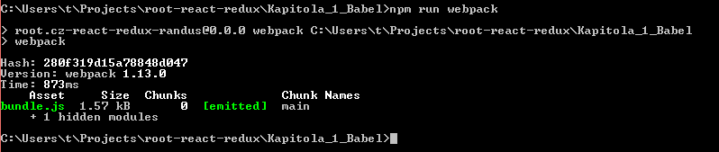
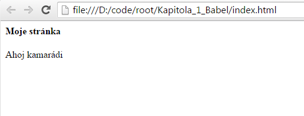
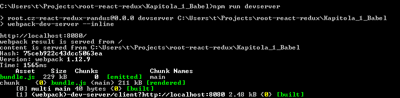
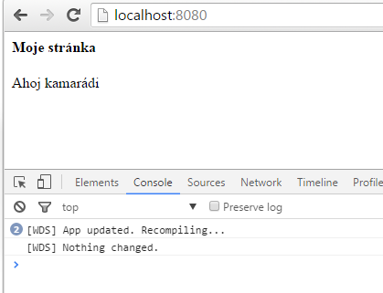
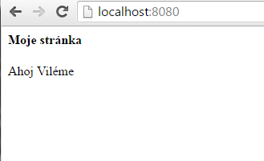

Redux + React 1/3 - Prostředí
========================

Vitejte u seriálu o javascriptových knihovnách *React* a *Redux*. Ve třech pokračování se podíváme na to, jak knihovny správně použít a vytvoříme si společně první aplikaci. Kód budeme psát v *ECMA Script 6* (nová verze *JavaScriptu*) a sestavovat pomocí *Webpacku*. Takže se budeme okrajově věnovat i těmto dvěma fenoménům.

Seriál představuje kompletní vývojové prostředí (devstack). Skládá se ze dvou knihoven, jedné integrační utility a jedno rozšíření známého jazyka.

Text se bude řidit třemi pravidly:

1. Vše co bude použito bude vysvětleno.
2. Žádné odbočky, co nás nevede k cíli nás vede od cíle
3. Pokud existuje více cest jak něčeho dosáhnou, použijeme tu nejjednodušší

Nyní si připravíme projekt a nakonfigurejeme si *webpack*.

### 1. Připravíme si adresář
Vytvoře si nový adresář a nakonfigurujte *npm* pomocí přikazu '**npm init**' (je třeba mít nainstalovaný *Node.js*). Získáte tak '*package.json*', což je důležité, protože *webpack* vám pak umožní používat všechny knihovny nainstalované pomocí balíčkového systému *NPM* i v prohližeči.

> kód celého příkladu si můžete prohlédnout [na Githubu](https://github.com/dizzyn/root-react-redux)

### 2. Připravíme si Webpack
*Webpack* je utilita, která zabalí všechny potřebné zdrojové kódy do jediného 'bundle'. Navíc umožňí nakonfigurovat různé transformace a jiné operace s kódem. Jeho výhodou je, že podporuje *NPM* balíčky (jak již bylo zmíněno) a poskytuje vývojový server, na který si člověk rád zvykne.

#### instalace:
'**npm install webpack -save**'

####  konfigurace
Vytvoříme si soubor '**webpack.config.js**' s následujícím obsahem:

    module.exports = {
        entry: "./src/index.js",  //náš vstupní bod aplikace
        output: {
            filename: "bundle.js"   //výstupní balík všech zdrojových kódů
        },
        module: { //sem budeme zanedlouho vkládat transformační moduly
        }
    };

Také budeme potřebovat adresář '**src**' a v něm soubor '**index.js**', který může obsahovat například '**document.write("Ahoj kamarádi")**'. To je zdrojový kód naší aplikace.

Ještě nám chybí reference v souboru '*package.json*' aby bylo možno webpack jednoduše spouštět.

    "scripts": {
      ...
      "webpack": "webpack"
    },

A máme hotovo. Webpack nám vyrobí balícek '**bundle.js**' z našich zdrojových kódů když ho zavoláme (příkazem '**npm run webpack**').

[*Výroba statického bundle.js*]

Soubor '**bundle.js**' nalinkujeme do *HTML* souboru '**index.html**', který bude mít následující obsah:

    <html>
      <head>
        <meta charset="UTF-8">
      </head>
      <body>
        <h4>Moje stránka</h4>
        
      </body>
    </html>

Pokud něco nefunguje tak jak má, zkontrolujte kód proti [repozitory](https://github.com/dizzyn/root-react-redux). Pokud vše funguje, na tránce je nápis "Ahoj kamarádi". Soubor '**index.html**' můžete zavolat pomocí svého oblíbeného lokálního *HTTP serveru* nebo otevřít v prohlížeči přímo ze souborového systému.

[*Naše stránka*]

Gratuluji, máte nakonfigurovaný *webpack*.

### 3. Webpack devserver

Vytváření statického '**bundle.js**' není přiliš produktivní přístup k vývoji, každé sestavení nějaký čas trvá. *webpack* proto poskytuje i vývojový server, který bude aktualizace kódu plynule dodávat do prohlížeče.

Přidejte si do '*package.json*' sekce 'scripts' tuto refetrenci:

        "devserver": "webpack-dev-server --inline"

(Parametr *--inline* spouští server na jednodušší *URL*)

...na konzoli zavolejte '**npm run devserver**' a v prohlížeči navštivte adresu '**http://localhost:8080**'. Celou stránku nyní dodává *webpack devserver*. Ve chvíli kdy změníte *JS* kód, stránka se automaticky aktualizuje. Trvá to rychleji než výroba bundle, protože *webpack* zpracuje jen soubor, ve kterém došlo ke změně. Začne to být významný rozdíl až budete mít více kódu v projektu.

[*Webpack dev server*]

Jen pro zajímavost uvádím, že *webpack* se snaží i o takzvaný *hot reload*. Pokud to kód umožní, dojde k aktualizaci bez obnovení stránky.

Průběh aktualizace kódu můžete sledovat na i na konzoli prohlížeče, včetně výpisu připadných chyb.

[*Automatická aktualizace stránky*]

Máme tedy připravený adresář projektu, vývojový server a generátor balíčků, který se nám bude hodit až budeme chtít aplikaci zveřejnit. ('**webpack --optimize-minimize**' vyrobí minifikovaný balíček, aktualizujte si '*package.json*'). *Webpack devserver* samozřejmě není určený na veřejnou produkci.

Teď si ale ještě trochu vylepšíme *JavaScript*. Náš projekt totiž nebudeme psát v JavaScriptu budoucnosti.

### 4. Babel - Cesta k ES6
Projekt *Babel* umožňuje využít nové funkce jazyka *JavaScript* tak, že je přeloží do staršího formátu vhodného pro současné prohlížeče. Zjednodušeně řečeno platí, že zatímco v pracovním adresáři máme *JavaScript* normy *ES6* (nebo dokonce *ES7*), prohlížeč dostává *JavaScript* podle normy *ES5*, který je dnes bezpečně podporovaný.

'Babel' je možno rozšiřovat o různé konstrukce jazyka. V nabídce jsou již schválené novinky, které jen čekají na implementaci v prohlížečích, ale také zcela nové funkce v různých fázích návrhů. Pokud programátoři zvolí konstrukce, které se později do standardu 'EcmaScriptu' nedostanou. Hrozí jim, že budou muset svůj projekt refaktorovat. [Nové funkce jsou velmi lákavé](https://babeljs.io/docs/learn-es2015/).

My použijeme dva ucelené balíky  (*presets*) a jedno jednotlivé rozšíření (*plugin*).

#### Instalace
Naintalujte si pomocí '**npm install -save**' tyto knihovny a zpřečtěte si jaké funkce vám přinesou:

- **babel-core** - knihovna [*Babel*](https://babeljs.io/) - Transpiler do *ES5*.
- **babel-loader** - integrace knihovny *Babel* do *webpacku*.
- **babel-preset-es2015** - různá rozšíření *JavaScriptu* pro *Babel*, [zde je kompletní seznam](https://babeljs.io/docs/plugins/preset-es2015/). My budeme využívat:
    - Rest-spread - ukážeme si za chvíli, slouží ke kombinaci (*immutable*) polí.
    - Modules - Modulární kód s ES6 žádný problém ([čtěte více, chcete-li](http://www.2ality.com/2014/09/es6-modules-final.html))
    - Třídy - *ES6* již podporuje [třídy s obvyklou syntaxí](https://github.com/lukehoban/es6features#classes)
    - Defaultní hodnoty parametrů funkcí - To co je v jiných jazycích už dávno - "*function(a = 1) {}*" nyní i v JavaScriptu.
- **babel-preset-react** - [rozšíření *JavaScriptu* pro podporu knihovny React](http://babeljs.io/docs/plugins/preset-react/).
- **babel-plugin-transform-class-properties** - Toto rozšíření navíc přidává [proměnné a konstanty ve třídách](https://github.com/jeffmo/es-class-fields-and-static-properties).

#### Konfigurace
Upravíme náš 'webpack.config.js' a přidáme *Babel loader* pro JS soubory.

    module: {
          loaders: [
              {
                  test: /\/src\/.+\.js$/,    //Všechny soubory s koncovkou js a jsx...
                  loader: 'babel-loader',  //prožeň babel-loaderem (integrace babelu a webpacku)
                  query: {
                      presets: ['react', 'es2015'], //vybrané babel presety: https://babeljs.io/docs/plugins/#presets
                      plugins: ["transform-class-properties", "transform-object-rest-spread"] //vybrané pluginy https://babeljs.io/docs/plugins/#transform-plugins
                  }
              }
        ]
    }

Je třeba restartovat *Webpack devserver*, jako pokaždé když se mění konfigurace.

### 5. ES6

Nyní by mělo být možno psát kód v 'ES6', což můžeme standno vyzkoušet. Změňte náš jediný příkaz document.write('Ahoj kamarádi') na něco takového:

    var x = ["Viléme"];

    var y = [ //Spread Array direktiva sečte dvě pole
        ...x,
        "Ahoj"
    };

    document.write(y[1] + " " + y[0]);

Pokud bude vše fungovat jak má, uvidíte následující stránku. Pokud ne, zkontrolujte si kód proti [repozitory](https://github.com/dizzyn/root-react-redux). 

[*Naše stránka s ES6 kódem přeloženým do ES5*]

Také se podívejte do zdrojového kódu uvnitř **bunde.js**. Uvidite že kód je transformmovaný do *ES5* syntaxe:

    var x = ["Viléme"];

	    var y = [].concat(x, ["Ahoj"]);

	    document.write(y[1] + " " + y[0]);

Gratuluji, máte připravený projekt, to není málo.

Než se potkáme přiště (nad knihovnou *Redux* a principem 'imutability') můžete se seznámit více s *ES6* - [https://github.com/ericdouglas/ES6-Learning](https://github.com/ericdouglas/ES6-Learning)