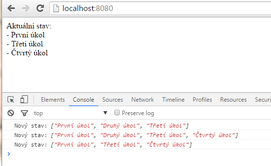

Redux + React 2/3 - Redux
======================

V minulém díle seriálu jsme si nakonfigurovali *webpack* nad projektovým adresářem. Také máme připravený *devserver* a víme jak exportovat *minifikovaný bundle* pro produkci. Navíc můžeme používat nové vlastnosti *JavaScriptu* díky transpileru *Babel*. Dnes si nainstalujeme *Redux* a podíváme se jak funguje. Nakonec si vytvoříme jednoduchý TODO list jako ukázkovou aplikaci.

### 1. Instalace Reduxu
Zavolejte v projektovém adresáři '**npm install redux -save-dev**'. A nainstalovanou knihovnu importujte do souboru *index.js* pomocí *ES6 Modules Import* direktivy:

    import { createStore } from 'redux';  //webpack sáhne pro redux do nainstalovaných NPM balíčků a zpřístupní z něj veřejnou funkci 'createStore'

### 2. Stav aplikace
Nejdříve si musíme dobře uvědomit co je to tzv. 'stav aplikace' (*state*). Je to úvodní podoba stránky společně se všemi změnami do okamžiku kdy tento stav posuzujeme. Zahrnuje *DOM elementy*, jejich obsah, pořadí, attributy, javascriptové proměnné apod.

Jistě znáte různé způsoby jak nakládat se stavem aplikace:

- Přidáváme CSS třídy - $this.toggleClass("checked") a pak je čteme $(".checked").removeClass("checked")
- Zapisujeme a čteme atributy elementů - model.removeItem(item.getAttribute("data-id"))
- Používáme globální JS struktury - window.data = [1,2,3] nebo $("#x").data("id", 1212)

V důsledku těchto postupů jsou pak data nepředvídatelně poschovávána pro různých místech. My se takovému přístupu vyhneme. *Redux* pracuje podle konceptu 'jediného zdroje pravdy' a tímto zdrojem je úložiště *Store*.  *Store* obsahuje všechna data a ostatní komponenty na tato data nahlíží a reagují. Když se data změní, komponenty se přerenderují. Žádná komponeta nezjišťuje stav jiné komponenty, vždy se dívá pouze do *Store*. Data vyjadřují aktuální stav aplikace a stejná data musí vždy aplikaci uvést do stejného stavu. Tomuto principu se řiká 'předvídatelný stav' (*predictable state*).

Z takoveho přístupu plyne mnoho výhod. Například debugování je velmi snadné, protože všechny změny prochází jediným místem do kterého můžeme nahlédnout. Navíc můžeme implemenovat funkci *Undo* - vracení akcí zpět, nebo celou aplikaci uložit (serializovat) jako v nějaké počítačové hře.

### 2. API Reduxu
Při práci s reduxem potkáme se třemi konstrukcenmi: *Store*, *Akce*, *Reducer*.

#### Store - srdce naší aplikace ####
*Store* je objekt ve kterém jsou uložena naše data. V celé aplikaci je jen jeden a vytváři se takto:

    var store = Redux.createStore(reducer);

Data mohou být jakéhokoliv typu, většinou je to objekt nebo pole.

> Náš TODO list bude obsahovat jednoduché pole stringů, co položka to jeden úkol.

Store poskytuje pouze 3 metody, v jednoduchosti je síla:

    store.getState() // vrací naše data, žádná jiná data nikde nemáme a nepotřebujeme
    store.subscribe(callback) // pokud chceme zjistit že se data změnila
    store.dispatch(akce) // provádíme akci, která změní data ve store uložená

#### Akce -  popisuje změnu ####
Pokud chceme změnit data ve *Store*, popíšeme tuto změnu pomocí jednoduchého objektu zvaného *Akce*. Objekt *Akce* má jeden povinný attribut  'type' pro identifikaci. Další attributy použijeme jak budeme potřebovat. Jinak řečeno: akce musí být jednoznačně identifgikovatelná a musí obsahovat všechna data potřebná k provedení.

Příklady tří akcí:

    var add = {
        type: "ADD_ITEM",
        text: "Nějaký text"
    }

    var remove = {
        type: "REMOVE_ITEM",
        id: 15
    }

    var removeAll = {
        type: "REMOVE_ALL"
    }

*Akce* voláme pomocí funkce dispatch(akce) na *Store*. Třeba takto:

    store.dispatch({ type: 'ADD_ITEM', task: "Nějaký text" });

#### Reducer -  změnu provede ####

Posledním dílem skládačky je reducer. Funkce kterou napíšeme a vložíme do store, aby bezpečně modifikovala data. Takto vypadá reducer:

    todo(state, action) {

        //zde bude kód který nahlédne do akce a podle toho co v ní najde vytvoří nový 'state'

        return newState;
    }

Reducer tedy čeká uvnitř store až zavoláme *dispatch(akce)* a jakmile se tak stane, Store zavolá reducer a předá mu:
- *state* - současná data aplikace
- *action* - celý objekt akce tak, jak jsme jej vložili do volání *dispatch()* (*Akce* obsahuje identifikaci 'type' a jakákoliv další data potřebná k provedení akce)

Uvnitř reduceru je kód, který podle identifikace akce provede požadovanou změnu s daty a vrátí novou podobu dat.

    if (action.type === "add") { //většinou se používá stará dobrá switch ... case konstrukce
        return [...state, action.text] //toto je ES6 Spread direktiva, která zde tvoří nové pole ze starého pole a jedné nové položky
    } else if (... //zde bude zpracování dalších akcí
    } else return state; //pokud nebyla žádná akce provedena tak vracíme původní nezměněná data

> Můžeme to chápat tak, že nový stav vznikne z interakce původního stavu s objektem *Akce*.

Poslední větev (*else*) je zde pro případ že *Store* obsahuje více reducerů. Každou akci totiž přijmou všechny reducery a reagují na ni (mění data) jen pokud je pro ně určena. V opačném připadě se data vrací nezměněna.

Druhý řádek obsahuje konstrukci kterou nelze v *JavaScriptu* podle normy *ES5* napsat kratší než na 3 řádky.

    var newState = myArray.slice(0); //naklonujeme pole
    newState.push(action.text); //přidáme prvek
    return newState; //nové pole vrátíme

Je na vás kterou variantu zvolíte. (můžete také sáhnout po nějaké [externí knihovně funkcí jako je např *lodash*](https://lodash.com/docs#concat))

Je zde jedno důležité pravidlo. Pokud reducer provede změnu dat, musí tato změna být takzvaně 'immutable'. Store tak pozná, že byla data změněna, aby mohl informovat vaši prezentační vrstvu (existují i další důvody). V praxi to znamená, že nikdy nezapisujeme do pole nebo objektu přímo. Nejprve strukturu naklonujeme a pak tuto kopii modifikujeme (vždy v tomto pořadí).

> O immutabilitě si můžete přečíst například ve vynikající knize [JavaScript Allongé](https://leanpub.com/javascriptallongesix) (ebook online zdarma)

### 3. Návrh naší aplikace
V konkrétním příkladě může být aplikace navržena například takto: Stavíme aplikaci která má nakládat s úkoly (todos), vytvoříme si tedy reducer který bude tyto úkoly spravovat a do něj přidáme podporu pro všechny akce které je možno s úkoly provádět (přidat nový, smazat, seřadit, smazat vše...). V reduceru také definujeme úvodní stav (*initial state*), tím může být například prázdné pole, nebo jako v našem připadě pole s nějakými úvodními položkami.

> V případě, že by naše aplikace spravovala i jiné agendy, například kalendář nebo filtr, vytvoříme pro ně vlastní reducery.

### 4. Kód aplikace
> kód příkladu s detailními komentáři si můžete prohlédnout [na Githubu](https://github.com/dizzyn/root-react-redux)

    var initialState = ["První úkol", "Druhý úkol"]; //tohle je úvodní stav reduceru, dáme do něj dva úkoly

    function todo(state = initialState, action) { //toto je reducer

      switch (action.type) {
        case 'ADD':  //zpracování první akce
          return [...state, action.text]

        case 'REMOVE':  //zpracování druhé akce
          var newState = [...state]
          newState.splice(action.id, 1);
          return newState;

        default:
             return state
      }
    }

    var store = createStore(todo); //zde vytváříme store

    // Naše opravdu jednoduchá zobrazovací komponenta vypisuje do konzole a do stránky
    store.subscribe(function() {
      var state = store.getState();
      console.log("Nový stav:", state);
      document.body.innerHTML = "Aktuální stav: - " + state.join(" - ")
    })

    //a několik akcí na zkoušku
    store.dispatch({ type: 'ADD', text: "Třetí úkol" }); //vložíme dva úkoly
    store.dispatch({ type: 'ADD', text: "Čtvrtý úkol" });
    store.dispatch({ type: 'REMOVE', id: 1 }); //odstraníme druhý úkol

Vyzkoušejte zda vše funguje. Na obrazovce uvidíte výsledný stav aplikace a na konzoli historii změn.

[*První Redux aplikace*]

V praxi je běžné rozdělit kód do více souborů. [Podívejte se jak jsou organizovány oficiální ukázky *Reduxu*](https://github.com/reactjs/redux/tree/master/examples).

Jestli se vám takové programování líbí, zkuste si ještě dopsat akce pro seřazení (**SORT**) a smazání všech položek (**REMOVE_ALL**). A pokud jste na sebe přísní, můžete zkusit napsat druhý reducer, který bude položky filtrovat. *Store* z více reducerů se vyrábí takto:

    var store = Redux.createStore(combineReducers({todo: todo, filter: filter}));

V příštím a posledním díle seriálu si napíšeme lepší zobrazovací vrstvu pomocí *React* komponent.
