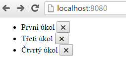
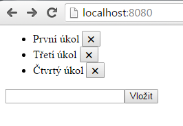

Redux + React 3/3 - React
===============================

A je zde poslední díl seriálu. Dnes si napíšeme sadu zobrazovacích komponent pro náš todo list nad knihovnou *React*. Představíme si také rozšíření javascriptové syntaxe zvané 'jsx'.

Z minula máme připraven *reducer* a dvě akce na přidávání a odebírání položek. Máme také provizorní zobrazovací vrstvu, která vypisuje položky ze *store*, kdykoliv dojde ke změně. Tuto vrstvu můžeme smazat a nahradit ji něčím šikovnějším.

### 1. Nainstalujeme si React:
React je rozdělen na obecné jádro a implementaci pro prohlíčeče. Nainstalujeme si oba dva balíčky:

    npm install react react-dom -save

Do souboru '**index.js**' přidáme patřičné importy:

    import React from 'react'; //je potřeba aby fungovala 'jsx' syntaxe
    import ReactDOM from 'react-dom'; //vstupní bod pro renderování reactu

Do '**index.html**' vložíme kontejner, do kterého budeme renderovat HTML:

    

A hned react vyzkoušíme:

    ReactDOM.render(
Ahoj
, document.getElementById("root"));

Nyní si spusťte *webpack dev server* ('**npm run devserver'**) a pokud na stránce uvidíte nápis 'Ahoj', vše funguje, jak má. Pokud ne, zkontrolujte si kód a nastavení v [repozitory na githubu](https://github.com/dizzyn/root-react-redux).

### 2. Co je to React:
React je něco jako šablonovaci systém. Na začátku vyrenderuje HTML stejně jako jiné šablonovací systémy, následně se pak ale postará i aktualizaci. Je to knihovna víceméně výstupní, do kódu, který pomocí *reactu* generujeme, už jinými cestami nesaháme. Dokonce takový kód ani nečteme, jediný kdo jej čte je prohlížeč.

Vzpomeňte si na principy *Reduxu* z minulé kapitoly: *Redux* obhospodařuje data ve *store* a ostatní části systému na ně jen nahlížejí. *React* je s takovým přístupem více než kompatibilní. Stačí jen vystavět strom vizuálních komponent a navěsit je na patřičná data.

*React* sám o sobě by nebyl ničím významným bez *jsx* syntaxe, která rozšiřuje *ECMAScript*. Ono `
Ahoj
` z příkladu přeloží *Babel* na: `_react2.default.createElement('div', null, 'Ahoj' )`, což už je pochopitelnější konstrukce, ale zase se tak hezky nečte.

### 3. Vytváříme strom komponent:
Naším cílem je rozdělit prezentační vrstvu na logické celky. V aplikaci chceme mít list úkolů, každá jeho položka bude mít tlačítko pro odstranění, dále pak formulář na vkládání nového úkolu, respektive *input* a *tlačítko* a to je vše.

Vytvořte si adresář '**components**' a do něj vložte 2 sobory:

## Komponeta I. - Položka seznamu úkolů

Prohlédněte si, jak vypadá komponenta knihovny *React*. Uvidíte *ES6* třídu, takto se nyní řeší v javascriptu objekty. Tato třída dědí *React.Component*. Díky dědičnosti je možno přetěžovat různé funkce z životního cyklu komponenty, například 'render()'. Funkce *render* (v tomto případě 'metoda') vrací objekty vytvořené pomocí 'jsx', konkrétně elementy *LI* a *BUTTON*.

    import React from 'react';

    export default class Item extends React.Component {

      render() {
        return <li>{this.props.text} <button onClick={this.props.removeItem}>&#10006;</button></li>;
      }
    };

V kódu také vidíme property "**this.props**", které obsahují konfiguraci komponenty. Jak se nastavují, si ukážeme hned na druhé komponentě:

## Komponeta II. - Hlavní komponenta systému

    import React from 'react';

    //Import vnořené komponenty
    import Item from './Item';

    export default class App extends React.Component {

      //uložíme data pro renderování do 'state', render se zavolá automaticky
      updateState() {
        this.setState({todos: this.props.store.getState()});
      }

      //okamžik v životním cyklu komponenty před prvním renderováním
      componentWillMount() {
        this.updateState() //úvodní načtení stavu
        this.props.store.subscribe(this.updateState.bind(this)); //aktualizace stavu
      }

      render() {
        //V props je uložena funkce na odebírání úkolů
        var removeItem = this.props.removeItem;

        //vytvoříme pro každou todo položku její DOM vyjádření
        var items = this.state.todos.map(function(todo, id) {
          return <Item key={id} text={todo} removeItem={function() { removeItem(id) }}/>
        });

        //vykreslíme komponenty
        return (

                  <ul>{items}</ul>
                
);
      }
    };

V kódu vidíme metodu *render*, která vykresluje list *UL* s položkami z pole. Tyto položky jsou instance komponenty *Item* a vidíme také, jak jsou vyplňovány zmíněné property. Pojďme to probrat postupně:
- `removeItem={}` na straně volání komponenty nastaví propertu, `this.props.removeItem` uvnitř komponenty propertu přečte.
- Komponenty se píší s velkým písmenem `<Item/>` tagy HTML s malým `
`
- `this.props` obsahují konfiguraci zvenčí, `this.state` obsahuje stav komponenty, po každé jeho změně se komponenta přerenderuje.
- `this.state` se nastavuje takto: `this.setState({todos: [] });` a čte takto: `this.state.todos`.
- Komponenta je navěšená na **store** pomocí funkce **subscribe**, kterou znáte z předchozího dílu seriálu.
- Atribut s názvem **key** obsahuje unikátní hodnotu a pomáhá reactu optimálně renderovat opakující se komponenty.
- `Store` se do komponenty dostal jako properta, stejně tak funkce `removeItem`.

 Pojďme se podívat, kde se tato komponenta volá.

## Vložení stromu komponent do aplikace:

V souboru '**index.js**' změňte kód, který vykresluje "Ahoj" na volání komponenty '**App**'. Nejprve ji ale inkludujte a také jí předejte *Store* a funkci na odebrání položky seznamu '**removeItem**':

    import App from './components/App';

    var removeItem = function(id) {
      store.dispatch({ type: 'REMOVE', id: id }); //odstraníme druhý úkol
    }

    ReactDOM.render(<App removeItem={removeItem} addItem={addItem} store={store}/>, document.getElementById("root"));

Nyní by mělo vše fungovat. Máme zobrazený list úkolů, které lze navíc odebírat pomocí tlačítka.

[*Náš TODO list*]

Pojďme si ještě shrnout, jak putují data prezentační vrstvou. Úplně na začátku máme funkci na odstraňování položek listu *(removeItem)*. Předáme ji jako propertu komponentě *App* a ta ji předá dál každé položce seznamu. Vzhledem k tomu, že si podobně předáváme i *Store*, mohla by být funkce definována i kdekoliv hlouběji v komponentovém stromu. Třeba až na úrovni *Item*. Záleží jen na vás. *Store* si předáváme proto, abychom z něj mohli číst data a také navěsit komponentu *App* na handler signalizující jejich změnu *(subscribe)*.

### 4. Vytvoření formuláře:
Nakonec nám ještě schází formulář pro vkládání nových úkolů. Použijeme postup, který již známe:

1. Vytvoříme si třetí soubor: '**componets/form.js**' a v něm komponentu "**Form**" poděděnou od **React.Component**
2. Do této komponenty vložíme metodu **render** s elementy **INPUT* a **BUTTON*
3. Vložíme komponentu do hlavní komponenty **App**, stejně jako **Item**
4. Přidáme ji zde i do metody **render**, hned pod list *UL*. Takto:

    <ul>{items}</ul>
    <Form addItem={this.props.addItem}/>

5. Vytvoříme si metodu '**addItem**' podobnou metodě **removeItem**. Její obsah známe z minulého dílu seriálu a předáme ji do komponenty *Form*.

Nyní se ale musíme podívat na princip, kterým čteme data z formulářů. Existují minimálně dva způsoby, jak data číst, my si ukážeme ten přímočařejší:

    render() {
        var input;
        var addItem = this.props.addItem;

        return (

                  <input ref={function(ref) { input = ref }}/>
                  <button onClick={function() {
                     addItem(input.value);
                     input.value = "";
                    }}>Vložit</button>
                
);
      }

Tlačítko, které řídí odesílání dat, musí získat přístup k inputu, který data drží. Pomocí funkce v atributu **ref** získáme instanci tohoto inputu během renderování a uložíme si ji do stejnojmenné proměnné. Odesílací funkce se pak pomocí této proměnné dotáže na hodnotu a obsah inputu vymaže. Data předáme funkci *addItem*, která je propertou komponenty *Form*, ale to už víte.

Pokud se vám formulář nepodařilo napsat, podívejte se do  [repozitory](https://github.com/dizzyn/root-react-redux).

[*Takhle vypadá náš TODO list s formulářem*]

A jsme úpně na konci.  Gratuluji. Takto se píší ty nejednodušší React komponenty. Budu rád za veškeré poznámky a návrhy v komentářích. Přeji hodně štěstí s Reactem a Reduxem a přidávám na konec jednu poznámku z konference *React Europe ´16*:

> React + Redux nemají API pokrývající všechny aspekty vývoje aplikací. Jsou návrhovým vzorem a jeho implementací. Pokud knihovnám porozumíte a přijmete je, mohou vám posloužit jako základ vaší aplikace.
